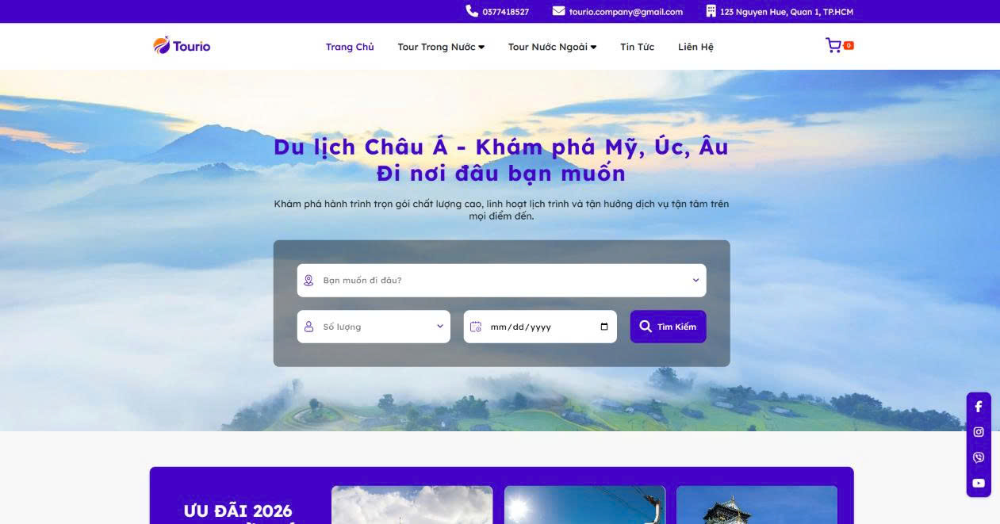
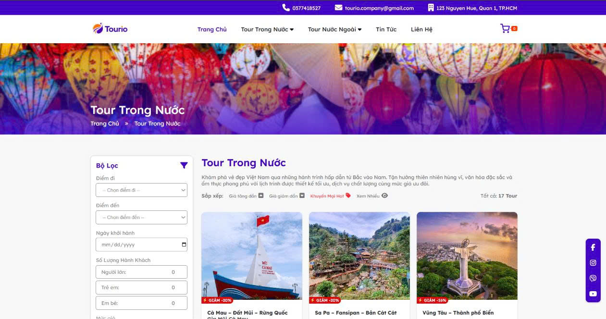
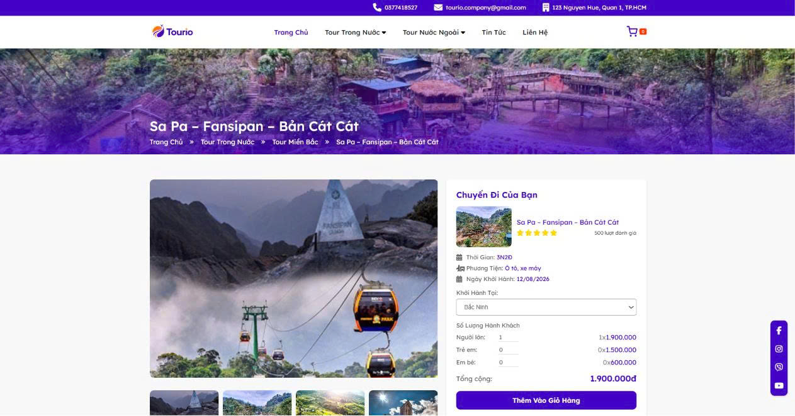
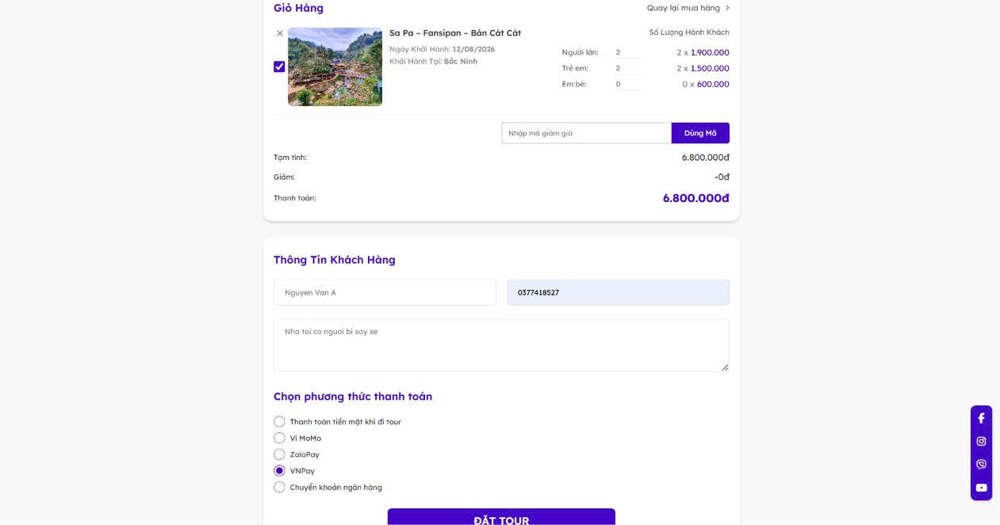
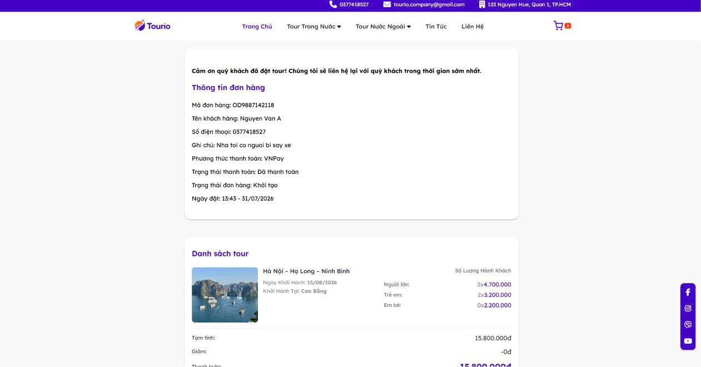
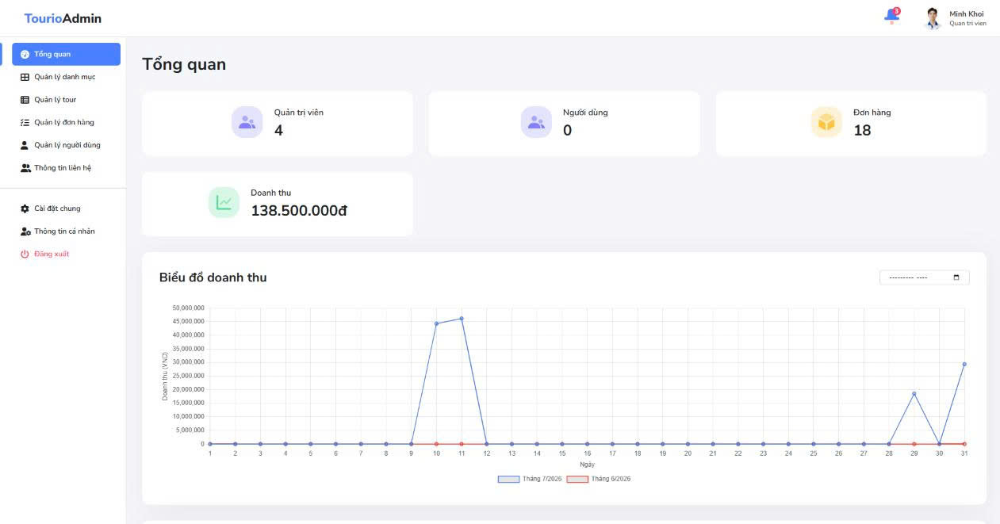
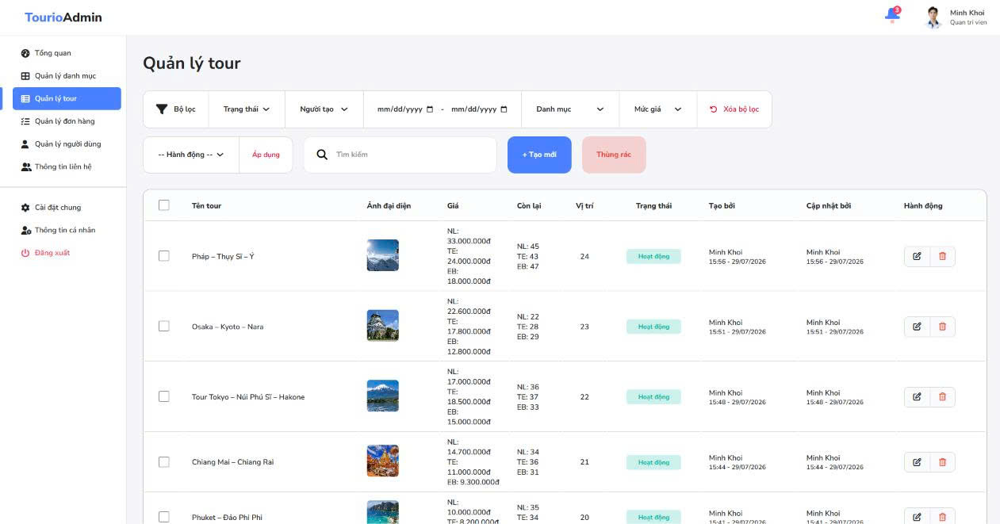
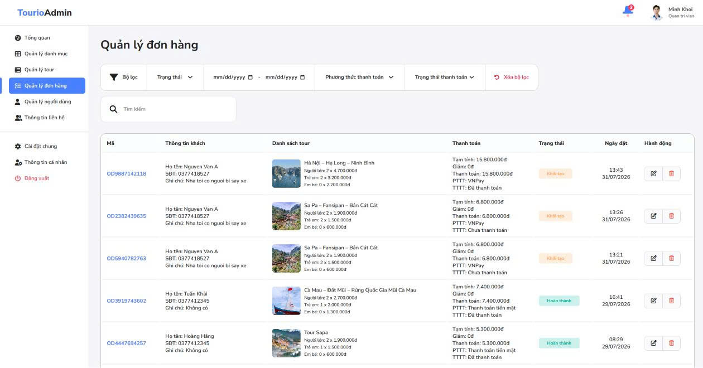

# Tourio - Travel Booking Platform

Tourio is a full-stack travel booking platform built with `Node.js`, `Express.js`, `MongoDB`, and `Pug` using a `Server-Side Rendering (SSR)` approach and `MVC architecture`.

The system includes both a customer-facing website and an admin dashboard for managing tours, categories, orders, users, roles, contacts, and website settings.

## Live Demo

- Client site: `https://tour-booking-platform-wbom.onrender.com/`
- Admin login: `https://tour-booking-platform-wbom.onrender.com/admin/account/login`

## Demo Payment Information

### VNPay Sandbox - NCB test card

Use the following test information when checking the VNPay payment flow in the demo environment:

- Bank: `NCB`
- Card number: `9704198526191432198`
- Card holder: `NGUYEN VAN A`
- Issue date: `07/15`
- OTP password: `123456`

> Note: This is sandbox test data provided for payment testing only.

### ZaloPay Sandbox

Use the following test information when checking the ZaloPay payment flow in the demo environment:

- Valid card number: `9704540000000062`
- Card holder: `NGUYEN VAN A`
- Issue date: `10/18`
- Verification OTP: `111111`

> Note: This is sandbox test data provided for payment testing only.

## Screenshots

### Client Website

#### Home page



#### Tour list page



#### Tour detail page



#### Checkout flow



#### Booking success page



### Admin Dashboard

#### Admin dashboard overview



#### Tour management page



#### Order management page



## Project Highlights

- Built an SSR web application with separate client and admin flows.
- Organized the codebase using MVC architecture for better maintainability.
- Implemented `60+ endpoints`, `18 controllers`, `20 route files`, `46 Pug view files`, and `9 MongoDB collections`.
- Supported end-to-end travel booking workflows from tour discovery to order creation and payment.
- Added role-based access control for the admin dashboard.
- Integrated media upload with Cloudinary.
- Supported multiple payment methods including `MoMo`, `ZaloPay`, and `VNPay`, with online payment flows implemented for `ZaloPay` and `VNPay`.

## Core Features

### Client-side features

- Browse tours by category
- Search tours by keyword and conditions
- Filter and sort tour lists
- View detailed tour information
- Add tours to cart
- Create bookings online
- View booking success details
- Submit contact requests

### Admin-side features

- Dashboard overview with revenue chart and newest orders
- Tour management
- Category management
- Order management
- User management
- Role and permission management
- Website information management
- Contact management
- Profile management
- New-order notification popup

## Technical Notes

- Rendering strategy: `Server-Side Rendering (SSR)`
- Architecture: `MVC`
- Template engine: `Pug`
- Database: `MongoDB` with `Mongoose`
- Validation: `Joi`
- Authentication and authorization: `JWT` + role-based permissions
- File upload: `Multer` + `Cloudinary`
- Payment methods: `MoMo`, `ZaloPay`, `VNPay`
- Email support: `Nodemailer`

## Business Flows Covered

- Admin creates and updates tours, categories, roles, and website settings.
- Client discovers tours through category pages, search, and sorting/filtering features.
- Client books a tour, and the system validates remaining stock before creating the order.
- The system updates tour seat availability after booking.
- Payment can be processed through online gateways.
- Admin monitors new orders from the dashboard and receives in-app notifications.

## Folder Structure

```text
project-1/
|-- config/
|-- controllers/
|   |-- admin/
|   `-- client/
|-- helpers/
|-- middlewares/
|-- models/
|-- public/
|   |-- admin/
|   `-- assets/
|-- routes/
|   |-- admin/
|   `-- client/
|-- validates/
|-- views/
|   |-- admin/
|   `-- client/
|-- .env.example
|-- index.js
`-- package.json
```

## Environment Variables

Create a `.env` file based on `.env.example`.

Required variables:

```env
DATABASE=
JWT_SECRET=
EMAIL_USERNAME=
EMAIL_PASSWORD=
EMAIL_SECURE=
CLOUDINARY_NAME=
CLOUDINARY_API_KEY=
CLOUDINARY_API_SECRET=
ZALOPAY_APPID=
ZALOPAY_KEY1=
ZALOPAY_KEY2=
ZALOPAY_DOMAIN=
DOMAIN_WEBSITE=
VNPAY_CODE=
VNPAY_SECRET=
VNPAY_URL=
```

## Getting Started

### 1. Install dependencies

```bash
yarn install
```

### 2. Configure environment variables

Copy `.env.example` to `.env` and fill in your values.

### 3. Start the development server

```bash
yarn start
```

The application runs on:

```text
http://localhost:3000
```

## Why This Project Matters

This project demonstrates practical experience with:

- building an SSR application instead of only SPA-based UI work
- structuring a medium-sized codebase with MVC
- handling CRUD-heavy business logic
- connecting admin operations with client-facing data
- working with authentication, authorization, media upload, email, and payment integrations
- solving real product scenarios such as empty-state handling, role-restricted actions, stock updates, and order monitoring

## Possible Future Improvements

- Add automated tests for critical booking and payment flows
- Improve pagination and advanced filtering across more modules
- Add order analytics by date range and category
- Introduce Docker-based local setup
- Improve logging and error monitoring for production

## Author

**Do Minh Khoi**

- GitHub: `https://github.com/Khoimin11`
- LinkedIn: `https://www.linkedin.com/in/do-minh-khoi-b403492bb`
